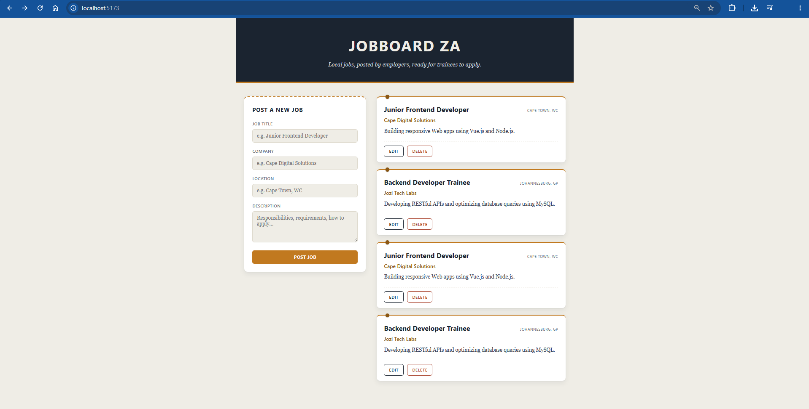

# JobBoard ZA

## Description

JobBoard ZA is a full-stack job listing application built to connect local South African employers with job seekers and trainees. Employers can publish, view, update, and remove job opportunities, providing an interactive platform for managing local employment listings in real time.

## Tech Stack

- **Node.js**: JavaScript runtime environment used to run the server-side application.
- **Express**: Fast, unopinionated web framework for Node.js used to build RESTful API endpoints.
- **MySQL**: Relational database management system used to persistently store job listing data.
- **Vue 3**: Progressive frontend framework used to build a reactive single-page interface.
- **Vite**: Modern frontend build tool providing fast development server startup and HMR.
- **Axios**: Promise-based HTTP client used by the frontend to send requests to the backend API.
- **mysql2**: MySQL client for Node.js using connection pooling for database communication.
- **cors**: Express middleware used to enable Cross-Origin Resource Sharing between frontend and backend.
- **dotenv**: Module used to load environment variables from a `.env` file into `process.env`.

## Prerequisites

- Node.js installed on your machine.
- `npm` available in your terminal.
- MySQL running locally on port `3307`.
- A `.env` file created in the `backend/` folder (see Environment Variables section).

## Environment Variables

Create a `.env` file inside the `backend/` folder with the following keys and placeholder values[cite: 1]:

```env
DB_HOST=localhost
DB_PORT=3307
DB_USER=root
DB_PASSWORD=
DB_NAME=jobboard_za
PORT=5000
```

## Screenshots


